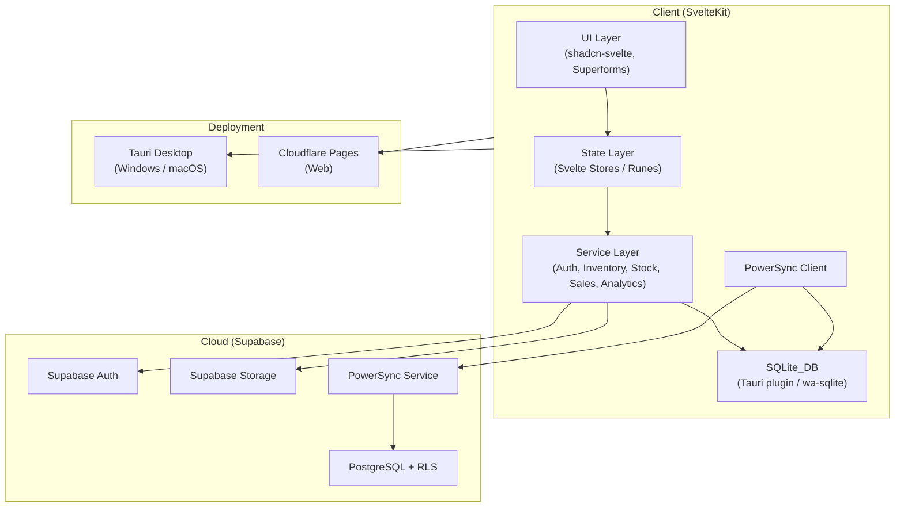
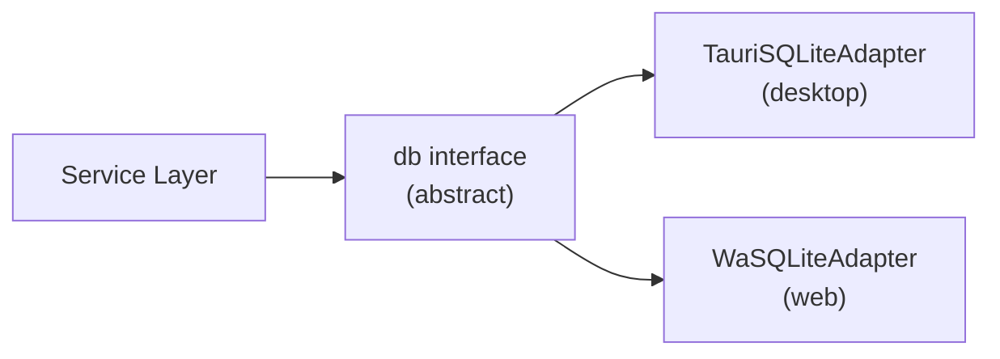

# Design Document

## Jhaerin Tire Supply Inventory Management System (JTS-IMS)

---

## Overview

JTS-IMS is an offline-first, cross-platform inventory management system for a tire supply business. It runs as a native desktop app (Windows/macOS via Tauri) and as a web app (Cloudflare Pages), sharing a single SvelteKit codebase. All reads and writes go to a local SQLite database, with PowerSync providing bi-directional sync to Supabase PostgreSQL in the background. This architecture guarantees zero-latency UI interactions regardless of network state.

The system supports two roles — Owner and Staff — with role-based access enforced at the UI, route, and database (RLS) layers. Core modules cover authentication, inventory management, stock transactions, sales, analytics, notifications, and settings.

### Key Design Decisions

- **Offline-first via SQLite + PowerSync**: All UI reads from local SQLite. PowerSync handles conflict resolution (last-write-wins by timestamp) and queues mutations when offline.
- **Single codebase, dual targets**: Platform-specific behavior (Tauri SQLite plugin vs. web SQLite adapter) is abstracted behind a `db` service interface.
- **Superforms + Zod everywhere**: All forms use Superforms with Zod schemas for consistent client-side and server-side validation.
- **shadcn-svelte Red & Black theme**: Consistent design system with lazy-loaded chart components to keep initial render fast.

---

## Architecture



### Data Flow

1. User action triggers a Svelte form (Superforms) or store mutation.
2. Zod schema validates input client-side.
3. Service layer writes to SQLite_DB (optimistic update).
4. UI reactively updates from SQLite_DB via Svelte stores.
5. PowerSync detects the local write and queues it for upload.
6. When online, PowerSync uploads the mutation to Supabase PostgreSQL.
7. Remote changes from other clients arrive via PowerSync and are applied to SQLite_DB.
8. Svelte stores react to SQLite_DB changes and re-render affected components.

### Platform Abstraction



A `db` interface is injected at app startup based on the detected platform (`window.__TAURI__`). Both adapters expose identical async CRUD methods, keeping service code platform-agnostic.

---

## Components and Interfaces

### Route Structure

```
src/routes/
├── (auth)/
│   ├── login/
│   ├── register/          # Owner only
│   └── reset-password/
├── (app)/
│   ├── +layout.svelte     # Auth guard + role check
│   ├── dashboard/
│   ├── inventory/
│   │   ├── +page.svelte   # Product list
│   │   └── [id]/          # Product detail / edit
│   ├── stock/
│   │   ├── in/
│   │   └── out/
│   ├── sales/
│   ├── analytics/
│   ├── notifications/
│   ├── settings/
│   └── users/             # Owner only
└── api/
    ├── auth/
    └── sync/
```

### Core Service Interfaces

```typescript
// db.interface.ts
interface DBAdapter {
  query<T>(sql: string, params?: unknown[]): Promise<T[]>;
  execute(sql: string, params?: unknown[]): Promise<void>;
  transaction(fn: (tx: DBAdapter) => Promise<void>): Promise<void>;
}

// auth.service.ts
interface AuthService {
  login(email: string, password: string): Promise<Session>;
  logout(): Promise<void>;
  refreshSession(): Promise<Session>;
  getSession(): Session | null;
  getRole(): 'owner' | 'staff' | null;
}

// inventory.service.ts
interface InventoryService {
  listProducts(filters: ProductFilters): Promise<TireProduct[]>;
  getProduct(id: string): Promise<TireProduct>;
  createProduct(data: CreateProductInput): Promise<TireProduct>;
  updateProduct(id: string, data: UpdateProductInput): Promise<TireProduct>;
  archiveProduct(id: string): Promise<void>;
}

// stock.service.ts
interface StockService {
  createStockIn(data: StockInInput): Promise<StockInTransaction>;
  updateStockIn(id: string, data: StockInInput): Promise<StockInTransaction>;
  deleteStockIn(id: string): Promise<void>;
  createStockOut(data: StockOutInput): Promise<StockOutTransaction>;
  listStockIn(filters: TransactionFilters): Promise<StockInTransaction[]>;
  listStockOut(filters: TransactionFilters): Promise<StockOutTransaction[]>;
}

// sales.service.ts
interface SalesService {
  createSale(data: SaleInput): Promise<SalesTransaction>;
  updateSale(id: string, data: SaleInput): Promise<SalesTransaction>;
  deleteSale(id: string): Promise<void>;
  listSales(filters: SaleFilters): Promise<SalesTransaction[]>;
}

// analytics.service.ts
interface AnalyticsService {
  getTopSelling(period: DateRange): Promise<ProductRank[]>;
  getLeastSelling(period: DateRange): Promise<ProductRank[]>;
  getInventoryValue(): Promise<number>;
  getRevenueSummary(period: DateRange, granularity: 'day' | 'week' | 'month'): Promise<RevenueSummary[]>;
  getProfitMargins(): Promise<ProfitMargin[]>;
  getInventoryTurnover(period: DateRange): Promise<number>;
  getSalesForecast(): Promise<ForecastPoint[]>;
  exportReport(type: ReportType, period: DateRange): Promise<string>; // returns Supabase Storage URL
}
```

### Key UI Components

| Component | Description |
|---|---|
| `ProductTable` | Searchable/filterable data table for tire products |
| `StockInForm` | Superforms form for recording incoming stock |
| `StockOutForm` | Superforms form for recording outgoing stock |
| `SaleForm` | Superforms form for recording a sale |
| `DashboardMetricCard` | KPI summary card (count, revenue, profit) |
| `SalesBarChart` | shadcn-svelte bar chart for daily/weekly/monthly sales |
| `RevenueTrendChart` | shadcn-svelte line chart for revenue vs. profit |
| `SalesBrandPieChart` | shadcn-svelte donut chart for brand breakdown |
| `NotificationPanel` | Slide-over panel listing all active notifications |
| `SyncStatusBadge` | Persistent indicator showing online/offline/syncing |
| `RoleGuard` | Wrapper component that hides/shows content by role |

---

## Data Models

### SQLite Schema (local)

```sql
-- Users (synced from Supabase Auth via PowerSync)
CREATE TABLE users (
  id          TEXT PRIMARY KEY,
  email       TEXT NOT NULL UNIQUE,
  role        TEXT NOT NULL CHECK(role IN ('owner', 'staff')),
  is_active   INTEGER NOT NULL DEFAULT 1,
  created_at  TEXT NOT NULL,
  updated_at  TEXT NOT NULL
);

-- Delivery Providers
CREATE TABLE delivery_providers (
  id          TEXT PRIMARY KEY,
  name        TEXT NOT NULL UNIQUE,
  created_at  TEXT NOT NULL,
  updated_at  TEXT NOT NULL
);

-- Tire Products
CREATE TABLE tire_products (
  id                   TEXT PRIMARY KEY,
  brand                TEXT NOT NULL,
  size                 TEXT NOT NULL,
  pattern              TEXT NOT NULL,
  quantity             INTEGER NOT NULL DEFAULT 0,
  unit_cost_price      REAL NOT NULL,
  retail_price         REAL NOT NULL,
  delivery_provider_id TEXT REFERENCES delivery_providers(id),
  low_stock_threshold  INTEGER,
  is_archived          INTEGER NOT NULL DEFAULT 0,
  created_at           TEXT NOT NULL,
  updated_at           TEXT NOT NULL,
  UNIQUE(brand, size, pattern),
  CHECK(retail_price >= unit_cost_price),
  CHECK(quantity >= 0)
);

-- Stock-In Transactions
CREATE TABLE stock_in_transactions (
  id                   TEXT PRIMARY KEY,
  tire_product_id      TEXT NOT NULL REFERENCES tire_products(id),
  delivery_provider_id TEXT REFERENCES delivery_providers(id),
  quantity             INTEGER NOT NULL CHECK(quantity > 0),
  transaction_date     TEXT NOT NULL,
  notes                TEXT,
  created_at           TEXT NOT NULL,
  updated_at           TEXT NOT NULL
);

-- Stock-Out Transactions
CREATE TABLE stock_out_transactions (
  id              TEXT PRIMARY KEY,
  tire_product_id TEXT NOT NULL REFERENCES tire_products(id),
  quantity        INTEGER NOT NULL CHECK(quantity > 0),
  reason          TEXT NOT NULL,
  transaction_date TEXT NOT NULL,
  created_at      TEXT NOT NULL,
  updated_at      TEXT NOT NULL
);

-- Sales Transactions
CREATE TABLE sales_transactions (
  id               TEXT PRIMARY KEY,
  tire_product_id  TEXT NOT NULL REFERENCES tire_products(id),
  quantity_sold    INTEGER NOT NULL CHECK(quantity_sold > 0),
  unit_retail_price REAL NOT NULL,
  unit_cost_price  REAL NOT NULL,
  revenue          REAL NOT NULL,
  gross_profit     REAL NOT NULL,
  transaction_date TEXT NOT NULL,
  created_at       TEXT NOT NULL,
  updated_at       TEXT NOT NULL
);

-- Notifications
CREATE TABLE notifications (
  id         TEXT PRIMARY KEY,
  type       TEXT NOT NULL CHECK(type IN ('low_stock', 'dead_stock', 'sync_status', 'report_ready')),
  message    TEXT NOT NULL,
  status     TEXT NOT NULL DEFAULT 'unread' CHECK(status IN ('unread', 'read', 'dismissed')),
  payload    TEXT,  -- JSON blob for extra context
  created_at TEXT NOT NULL
);

-- Settings
CREATE TABLE settings (
  key        TEXT PRIMARY KEY,
  value      TEXT NOT NULL,
  updated_at TEXT NOT NULL
);

-- Indexes
CREATE INDEX idx_tire_products_brand ON tire_products(brand);
CREATE INDEX idx_tire_products_size ON tire_products(size);
CREATE INDEX idx_tire_products_pattern ON tire_products(pattern);
CREATE INDEX idx_stock_in_date ON stock_in_transactions(transaction_date);
CREATE INDEX idx_stock_out_date ON stock_out_transactions(transaction_date);
CREATE INDEX idx_sales_date ON sales_transactions(transaction_date);
CREATE INDEX idx_sales_product ON sales_transactions(tire_product_id);
```

### TypeScript Types

```typescript
type Role = 'owner' | 'staff';
type NotificationType = 'low_stock' | 'dead_stock' | 'sync_status' | 'report_ready';
type NotificationStatus = 'unread' | 'read' | 'dismissed';
type SyncState = 'online' | 'offline' | 'syncing';

interface TireProduct {
  id: string;
  brand: string;
  size: string;
  pattern: string;
  quantity: number;
  unitCostPrice: number;
  retailPrice: number;
  deliveryProviderId: string | null;
  lowStockThreshold: number | null;
  isArchived: boolean;
  createdAt: string;
  updatedAt: string;
}

interface StockInTransaction {
  id: string;
  tireProductId: string;
  deliveryProviderId: string | null;
  quantity: number;
  transactionDate: string;
  notes: string | null;
  createdAt: string;
  updatedAt: string;
}

interface StockOutTransaction {
  id: string;
  tireProductId: string;
  quantity: number;
  reason: string;
  transactionDate: string;
  createdAt: string;
  updatedAt: string;
}

interface SalesTransaction {
  id: string;
  tireProductId: string;
  quantitySold: number;
  unitRetailPrice: number;
  unitCostPrice: number;
  revenue: number;
  grossProfit: number;
  transactionDate: string;
  createdAt: string;
  updatedAt: string;
}

interface Notification {
  id: string;
  type: NotificationType;
  message: string;
  status: NotificationStatus;
  payload: Record<string, unknown> | null;
  createdAt: string;
}
```

### Zod Schemas (representative)

```typescript
// tire-product.schema.ts
export const createProductSchema = z.object({
  brand: z.string().min(1).max(100),
  size: z.string().min(1).max(50),
  pattern: z.string().min(1).max(100),
  unitCostPrice: z.number().positive(),
  retailPrice: z.number().positive(),
  deliveryProviderId: z.string().uuid().nullable(),
  lowStockThreshold: z.number().int().nonnegative().nullable(),
}).refine(d => d.retailPrice >= d.unitCostPrice, {
  message: 'Retail price must be >= unit cost price',
  path: ['retailPrice'],
});

// stock-in.schema.ts
export const stockInSchema = z.object({
  tireProductId: z.string().uuid(),
  deliveryProviderId: z.string().uuid().nullable(),
  quantity: z.number().int().positive({ message: 'Quantity must be greater than zero' }),
  transactionDate: z.string().datetime(),
  notes: z.string().max(500).nullable(),
});

// sales.schema.ts
export const saleSchema = z.object({
  tireProductId: z.string().uuid(),
  quantitySold: z.number().int().positive(),
  transactionDate: z.string().datetime(),
});
```

### Supabase PostgreSQL (cloud mirror)

The Supabase schema mirrors the SQLite schema with the following additions:
- `UUID` primary keys (matching SQLite `TEXT` UUIDs)
- RLS policies per table scoped by `auth.uid()` and role claim
- Foreign key constraints with `ON DELETE RESTRICT` for transactions
- Unique constraint on `tire_products(brand, size, pattern)`
- Check constraints matching SQLite checks
- `updated_at` triggers for automatic timestamp management

### PowerSync Sync Rules

```yaml
# sync-rules.yaml
bucket_definitions:
  user_data:
    parameters:
      - name: user_id
        token_parameter: sub
    data:
      - SELECT * FROM tire_products
      - SELECT * FROM stock_in_transactions
      - SELECT * FROM stock_out_transactions
      - SELECT * FROM sales_transactions
      - SELECT * FROM delivery_providers
      - SELECT * FROM notifications WHERE user_id = $user_id
      - SELECT * FROM settings WHERE user_id = $user_id
```

---

## Correctness Properties

*A property is a characteristic or behavior that should hold true across all valid executions of a system — essentially, a formal statement about what the system should do. Properties serve as the bridge between human-readable specifications and machine-verifiable correctness guarantees.*

### Property 1: Stock-In quantity invariant

*For any* tire product and any stock-in transaction with a positive quantity, after saving the transaction the product's quantity in SQLite_DB SHALL equal its previous quantity plus the transaction quantity.

**Validates: Requirements 9.1**

### Property 2: Stock-Out quantity invariant

*For any* tire product with quantity Q and any stock-out transaction with quantity N where N ≤ Q, after saving the transaction the product's quantity SHALL equal Q − N and SHALL never be negative.

**Validates: Requirements 10.1, 10.3, 18.5**

### Property 3: Stock-Out rejection when insufficient

*For any* stock-out transaction where the requested quantity exceeds the current tire product quantity, the system SHALL reject the submission and the product quantity SHALL remain unchanged.

**Validates: Requirements 10.3, 18.5**

### Property 4: Sales quantity decrement invariant

*For any* tire product with quantity Q and any sales transaction with quantity_sold N where N ≤ Q, after saving the sale the product's quantity SHALL equal Q − N.

**Validates: Requirements 11.3, 11.4**

### Property 5: Sales revenue and gross profit calculation

*For any* sales transaction with quantity_sold Q, unit_retail_price P, and unit_cost_price C, the persisted revenue SHALL equal Q × P and the persisted gross_profit SHALL equal (Q × P) − (Q × C).

**Validates: Requirements 11.2**

### Property 6: Retail price ≥ cost price invariant

*For any* tire product, the retail_price SHALL always be greater than or equal to the unit_cost_price at the time of creation or update.

**Validates: Requirements 8.8, 18.4**

### Property 7: Duplicate product rejection

*For any* attempt to create a tire product with the same (brand, size, pattern) combination as an existing active product, the system SHALL reject the creation and the catalog SHALL remain unchanged.

**Validates: Requirements 8.5, 18.4**

### Property 8: Stock-In edit recalculation

*For any* existing stock-in transaction with original quantity O being edited to new quantity N, the associated tire product's quantity SHALL be updated by the delta (N − O), resulting in a final quantity equal to the pre-edit quantity plus (N − O).

**Validates: Requirements 9.3**

### Property 9: Sales edit recalculation

*For any* existing sales transaction with original quantity_sold O being edited to new quantity_sold N, the associated tire product's quantity SHALL be updated by the delta (O − N), and revenue and gross_profit SHALL be recalculated using the new quantity.

**Validates: Requirements 11.7**

### Property 10: Sales delete restores quantity

*For any* deleted sales transaction with quantity_sold N, the associated tire product's quantity SHALL increase by N after deletion.

**Validates: Requirements 11.8**

### Property 11: Stock-In delete decrements quantity

*For any* deleted stock-in transaction with quantity N, the associated tire product's quantity SHALL decrease by N after deletion, and SHALL never go below zero.

**Validates: Requirements 9.4**

### Property 12: Inventory value calculation

*For any* set of active (non-archived) tire products, the inventory value report SHALL equal the sum of (quantity × unit_cost_price) for every product in the set.

**Validates: Requirements 12.3**

### Property 13: Profit margin calculation

*For any* tire product with retail_price P and unit_cost_price C, the calculated profit margin SHALL equal (P − C) / P expressed as a percentage, and SHALL be between 0% and 100% inclusive given the retail price ≥ cost price invariant.

**Validates: Requirements 13.1**

### Property 14: Low stock alert threshold

*For any* tire product whose current quantity is at or below its effective Low_Stock_Threshold (product-specific if set, otherwise global), the Notification_Service SHALL have a low_stock notification for that product.

**Validates: Requirements 14.1, 17.1, 17.2**

### Property 15: Zod schema round-trip validation

*For any* valid domain object (TireProduct, StockInTransaction, StockOutTransaction, SalesTransaction), serializing it to the Zod schema input shape and parsing it back SHALL produce an equivalent object with no data loss.

**Validates: Requirements 18.1, 18.2**

---

## Error Handling

### Validation Errors

All forms use Superforms with Zod schemas. Validation errors are returned as field-level messages and displayed inline next to the relevant input. No form submission reaches the service layer until all Zod constraints pass.

### Insufficient Stock

When a stock-out or sale quantity exceeds available stock, the service layer throws a typed `InsufficientStockError`. The form action catches this and returns it as a form-level error message displayed at the top of the form.

### Sync Errors

PowerSync handles retry logic internally. If a mutation fails to upload after exhausting retries, the Notification_Service creates a `sync_status` notification with the error detail. The SyncStatusBadge turns red and shows an error tooltip.

### Auth Errors

- JWT expiry: silently refreshed via `supabase.auth.onAuthStateChange`.
- Refresh failure: redirected to `/login` with session cleared.
- Role violation: redirected to `/dashboard` with an `access-denied` toast notification.

### Database Errors

SQLite constraint violations (unique, check, foreign key) are caught at the service layer and mapped to user-friendly error messages. They are never exposed as raw SQL errors in the UI.

### Offline Behavior

All writes succeed locally regardless of connectivity. The sync queue persists across app restarts. If a conflict is detected on sync (another client modified the same record), last-write-wins resolution applies using the `updated_at` timestamp.

### Report Export Errors

If a PDF export or Supabase Storage upload fails, the Analytics service returns a typed error. The UI displays a toast notification with a retry option. No partial files are left in Storage.

---

## Testing Strategy

### Unit Tests (Vitest)

Unit tests cover pure business logic functions with specific examples and edge cases:

- Zod schema validation: valid inputs pass, invalid inputs produce correct error messages
- Revenue and gross profit calculation functions
- Profit margin calculation
- Inventory value aggregation
- Sales forecast projection logic
- Low stock threshold resolution (product-specific vs. global)
- Dead stock detection logic

Focus on concrete examples and boundary conditions. Avoid duplicating coverage that property tests already provide.

### Property-Based Tests (fast-check, minimum 100 iterations each)

Property-based testing is applied to the core business logic layer — the service functions that operate on SQLite data. Each property test uses fast-check to generate random valid inputs and verifies the universal property holds.

**Library**: [fast-check](https://fast-check.dev/) for TypeScript/JavaScript

Each property test is tagged with a comment referencing the design property:
```
// Feature: jhaerin-tire-supply-ims, Property N: <property_text>
```

Properties to implement as property-based tests:

| Property | Test Description |
|---|---|
| Property 1 | Stock-In quantity invariant |
| Property 2 | Stock-Out quantity invariant (valid case) |
| Property 3 | Stock-Out rejection when insufficient |
| Property 4 | Sales quantity decrement invariant |
| Property 5 | Sales revenue and gross profit calculation |
| Property 6 | Retail price ≥ cost price invariant |
| Property 7 | Duplicate product rejection |
| Property 8 | Stock-In edit recalculation |
| Property 9 | Sales edit recalculation |
| Property 10 | Sales delete restores quantity |
| Property 11 | Stock-In delete decrements quantity |
| Property 12 | Inventory value calculation |
| Property 13 | Profit margin calculation |
| Property 14 | Low stock alert threshold |
| Property 15 | Zod schema round-trip validation |

Service functions under test use an in-memory SQLite adapter (wa-sqlite or better-sqlite3 in Node) so tests run fast without I/O overhead.

### Integration Tests

Integration tests verify wiring between layers with 1–3 representative examples:

- Supabase Auth login/logout flow (staging environment)
- PowerSync sync session establishment and JWT validation
- RLS policy enforcement: Staff cannot read/write Owner-only tables
- Supabase Storage upload for report export
- Tauri plugin availability on desktop target

### Snapshot Tests

- SvelteKit route rendering: key pages render without errors
- shadcn-svelte chart components render with mock data

### E2E Tests (Playwright)

Critical user flows:

1. Login → Dashboard loads with metrics
2. Create product → appears in inventory list
3. Record stock-in → product quantity increments
4. Record sale → product quantity decrements, revenue updates
5. Go offline → record sale → go online → verify sync

### Test Configuration

```typescript
// vitest.config.ts (property tests)
export default defineConfig({
  test: {
    include: ['**/*.property.test.ts'],
    // fast-check runs 100 iterations by default per property
  }
});
```
